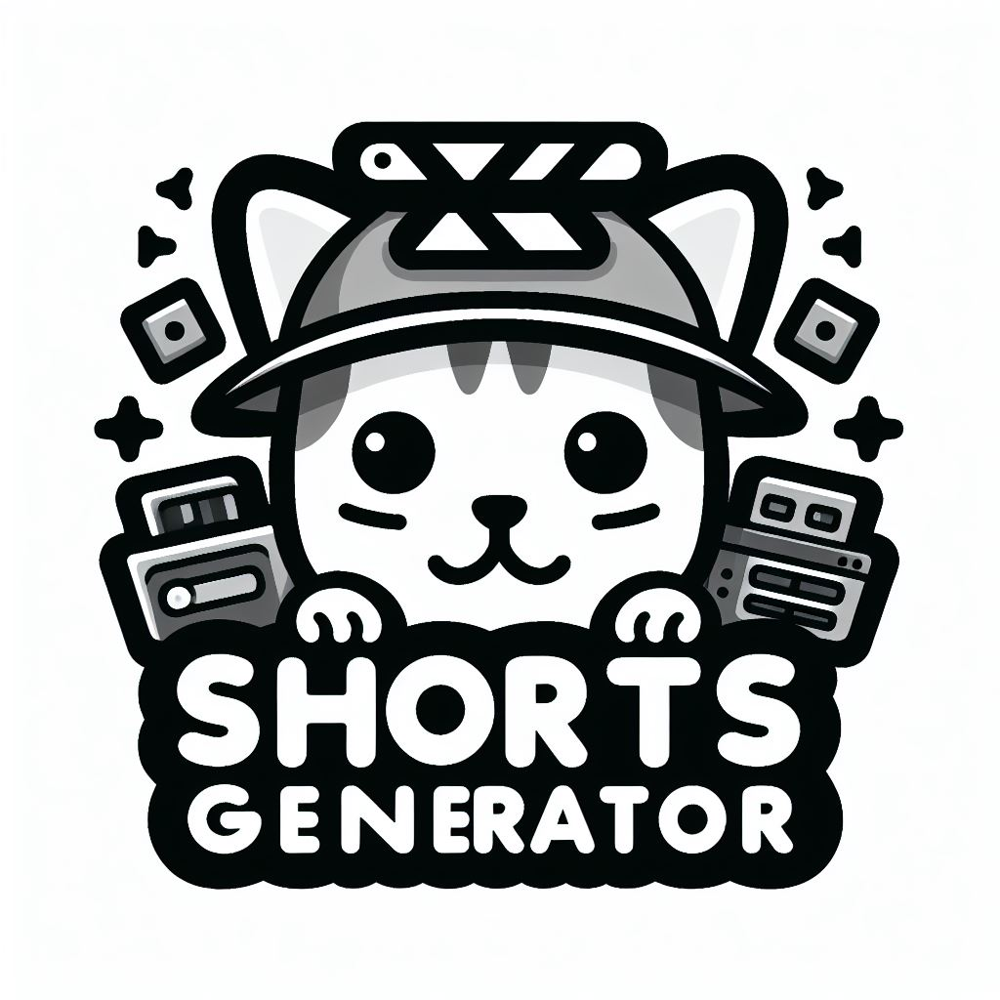
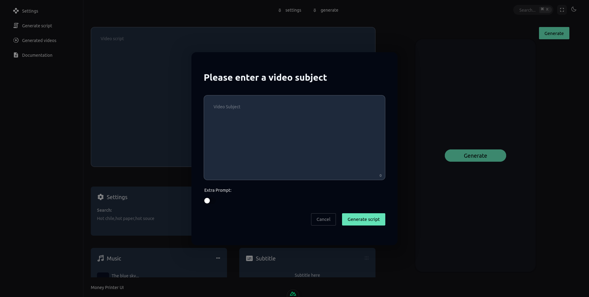

# ShortsGenerator



Automate YouTube Shorts creation locally — script generation, stock video search, TTS voiceover, subtitles, background music, and social media scheduling.

## Features

- **AI Script Generation** — uses g4f (free) or Gemini to generate video scripts
- **Stock Video Search** — auto-downloads matching clips from Pexels
- **Multi-Voice TTS** — Supertonic (local, 10 voices, 33 languages), TikTok TTS (fallback), KittenTTS, Qwen3-TTS (local, 9 preset timbres + Voice Design + Voice Clone + character voices 🐶 EL-PERRO / EL-GANCHO / LA-FIERA / SOMBRA, hook/retention steering presets)
- **Subtitle Templates** — 10 presets (classic, modern_glow, bold_outline, minimal, cinematic, neon, social_viral, floating, news_ticker, karaoke_highlight)
- **Background Music** — auto-mix from your music library or extract from a video
- **Image Stitching** — upload multiple images to stitch at the start of the video with configurable duration per image (default 5s)
- **Frame Extraction** — extract a frame from any generated video for thumbnails
- **Aspect Ratios** — 9:16, 16:9, 1:1, 4:5, 21:9
- **Multi-Business MagicSync** — configure multiple API keys for different businesses; select which one to use when scheduling
- **Social Media Scheduling** — schedule posts to Instagram, TikTok, Facebook, LinkedIn, YouTube via MagicSync
- **Hardware Acceleration** — auto-detects GPU for faster ffmpeg encoding


[YouTube](https://youtu.be/s7wZ7OxjMxA) or click on the image.
[](https://youtu.be/s7wZ7OxjMxA "Short generator, video generator")




## Local usage:

```bash
git clone https://github.com/leamsigc/ShortsGenerator.git
cd ShortsGenerator
cp .env.example .env
#Start the backend
python Backend/main.py

#Start the frontend
cd UI && pnpm i && npx  nuxt dev --tunnel #Tunnel to add the connection to upload the videos to magicsync  
```

## Workflow


## Quick Start (Docker)

```bash
git clone https://github.com/leamsigc/ShortsGenerator.git
cd ShortsGenerator
cp .env.example .env
# Edit .env — at minimum set PEXELS_API_KEY and IMAGEMAGICK_BINARY
docker compose up -d
```

Open **http://localhost:5000** or **http://localhost:3000** for the frontend.

## Manual Setup

### Backend (Python Flask on :8080)

```bash
conda activate shortsgenerator   # required: Python 3.11 env (see onBoard.md).
                                 # main.py exits immediately on any other version.
pip install -r requirements.lock # pre-resolved; plain requirements.txt can stall pip's resolver
cp .env.example .env
# Fill in PEXELS_API_KEY, IMAGEMAGICK_BINARY, etc.
cd Backend
python main.py
```

### Frontend (Nuxt 3 on :3000)

```bash
cd UI
npm install
npm run dev
```

The frontend depends on the backend running on port 8080.

## Environment Variables

| Variable | Required | Description |
|----------|----------|-------------|
| `PEXELS_API_KEY` | Yes | Stock video search |
| `IMAGEMAGICK_BINARY` | Yes | Path to ImageMagick convert (e.g. `/usr/bin/convert`) |
| `TIKTOK_SESSION_ID` | No | TikTok TTS fallback |
| `GOOGLE_API_KEY` | No | Gemini AI model |
| `ASSEMBLY_AI_API_KEY` | No | Cloud subtitle generation |
| `OPENAI_API_KEY` | No | OpenAI models |
| `MAGICSYNC_BASE_URL` | No | Default MagicSync server URL |
| `MAGICSYNC_API_TOKEN` | No | Default MagicSync API token |

See [EnvironmentVariables.md](EnvironmentVariables.md) for the full list.

## Usage

1. **Generate a script** — enter a video subject, select a script template, click Generate
2. **Review & edit** — modify the script, add search keywords, select subtitle template
3. **Upload images (optional)** — upload images that will be stitched at the start of the video; set duration per image
4. **Select voice** — choose TTS engine and voice style (Qwen3 clones/designs can be saved as named "My voices" in your browser and reused as presets)
5. **Set aspect ratio** — 9:16 (default), 16:9, 1:1, or 4:5
6. **Generate video** — downloads stock clips, generates TTS, combines everything with subtitles
7. **Add music** — pick from your music library or extract audio from a video
8. **Schedule** — in the Videos page, click "Schedule Upload", select a business and platforms, set date/time, and post via MagicSync

### Image Stitching

In the **Generate** page, click the **Images** section and upload one or more images. Each image becomes a video segment at the start of the final video. Adjust the global duration (default 5s) or set per-image duration. Images are scaled and cropped to match the selected aspect ratio.

### Multi-Business MagicSync

In **Settings → MagicSync Integration**, add API keys for each business. Each business has its own MagicSync URL, API token, and video base URL. When scheduling a video, select which business to use — the correct credentials are sent automatically.

### Thumbnail Extraction

`POST /api/extract-frame` extracts a frame from any generated video at a given timestamp. Use this to generate custom thumbnails.

## API Endpoints

| Method | Endpoint | Description |
|--------|----------|-------------|
| POST | `/api/generate` | Full video generation pipeline |
| POST | `/api/script` | Generate script only |
| POST | `/api/search-and-download` | Search + download + TTS + combine |
| POST | `/api/regenerate-video` | Re-render audio + video only (no AI calls, reuses metadata) |
| GET | `/api/tts/status` | TTS engine health (supertonic/tiktok/qwen3) |
| GET | `/api/tts/voices?engine=` | Voices + extras per engine (languages, modes, presets) |
| POST | `/api/tts/qwen/preview` | Audition a Qwen3 voice/mode without full generation |
| POST | `/api/tts/qwen/clone-reference` | Upload a reference clip for Qwen3 voice clone |
| POST | `/api/cancel` | Cancel generation |
| POST | `/api/addAudio` | Add background music to video |
| POST | `/api/upload-music` | Upload music file |
| POST | `/api/download-music-url` | Download & extract audio from URL |
| POST | `/api/upload-video` | Upload video files |
| POST | `/api/upload-image` | Upload images for video stitching |
| POST | `/api/extract-frame` | Extract a frame from a video |
| GET | `/api/getVideos` | List generated videos |
| GET | `/api/getSongs` | List available music |
| GET | `/api/models` | List TTS voices |
| GET | `/api/settings` | Get global settings |
| POST | `/api/settings` | Update global settings |
| POST | `/api/magicsync/accounts` | List MagicSync accounts |
| POST | `/api/schedule-to-magicsync` | Schedule a post |
| GET | `/api/video/<filename>` | Serve generated video |
| GET | `/static/generated_videos/<file>` | Static video files |

## Directory Structure

```
Backend/
├── main.py              # Flask app, all API routes
├── video.py             # Video processing, ffmpeg, subtitles, images
├── settings.py          # Global defaults
├── gpt.py               # AI script generation
├── search.py            # Pexels stock video search
├── tiktokvoice.py       # TikTok TTS
├── supertonic_tts.py    # Supertonic local TTS
├── qwen3_tts.py         # Qwen3 TTS (preset timbres + Voice Design + Voice Clone)
├── requirements.lock    # Pre-resolved pins (use this for pip install; see Notes)
├── classes/
│   └── Shorts.py        # Core pipeline orchestrator
UI/
├── pages/
│   ├── generate/index.vue  # Video generation workspace
│   ├── videos/index.vue    # Gallery + scheduling
│   └── settings.vue        # Global settings + MagicSync
├── composables/
│   ├── useVideoSettings.ts # Video generation state
│   └── useGlobalSettings.ts # App-wide settings
└── stores/
```

## Notes

- **Python 3.11 only.** The backend exits on startup with any other version
  (`conda activate shortsgenerator` first, in the same terminal). Running it
  under `base` (3.10) fails with cryptic native-lib errors (e.g. torchaudio
  `.so` load failures) — never install project packages into `base`.
- **Install via the lockfile.** `pip install -r requirements.lock` instead of
  `requirements.txt`: the graph (torch/CUDA + `qwen-tts` → pinned
  `transformers==4.57.3` → `huggingface-hub<1.0`) makes pip's resolver stall
  (`resolution-too-deep`). After changing pins, regenerate with:
  `uv pip compile requirements.txt --python $(which python) -o requirements.lock`
- **Qwen3-TTS is optional but local.** Select it in Settings → TTS Engine for
  preset timbres, free-form Voice Design, or Voice Clone, plus a preview
  audition button. Missing GPU deps degrade gracefully to "unavailable" with
  Supertonic/TikTok fallback. First preview downloads ~3GB of weights once.
- **g4f Gemini cookies.** The free g4f path reads Firefox/Chrome login cookies
  via `browser-cookie3` (required package). If Settings reports "cookies
  outdated" with 0 cookies found, check the package is installed and restart
  the backend — re-logging in can't help until the reader exists. Snap-Firefox
  profiles are supported. Escape hatches: toggle OFF "Use browser cookies"
  (cookie-free providers) or set provider `gemini` with a free
  `GOOGLE_API_KEY`.

## Contributing

Pull requests are welcome. For major changes, please open an issue first.

## License

See [`LICENSE`](LICENSE) for details.
